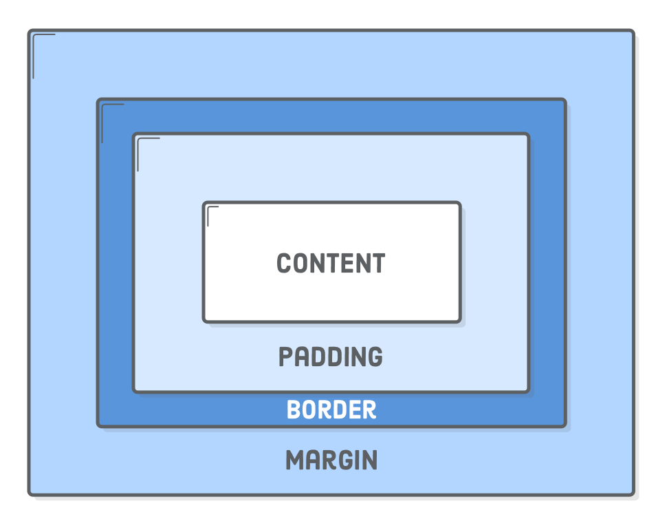
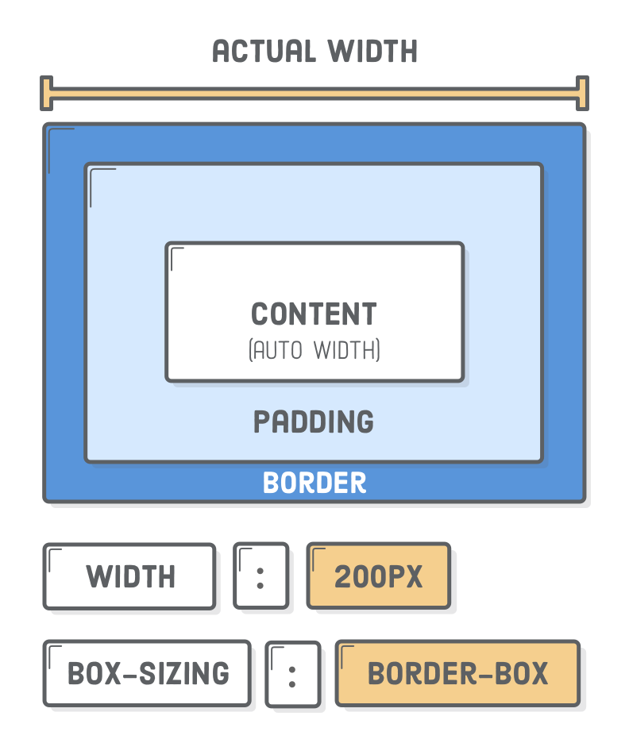
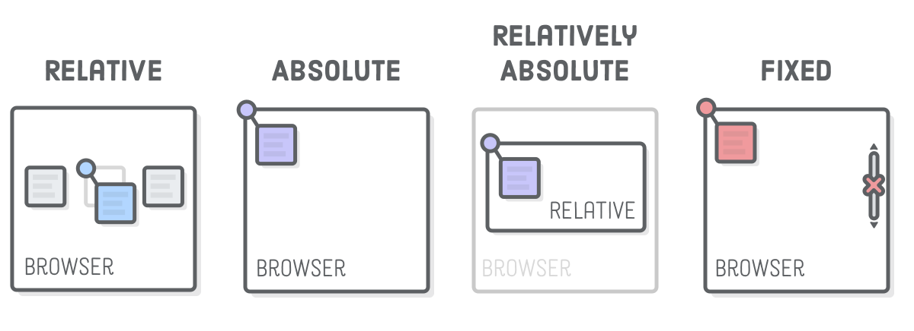
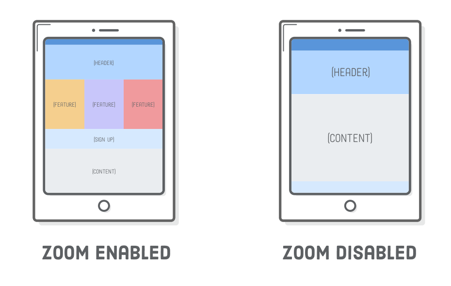
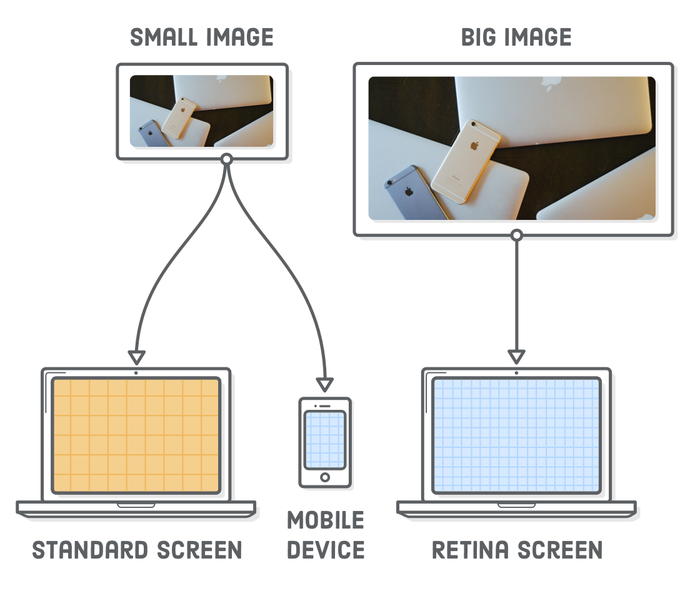

# A hint summary

### ```<!DOCTYPE html>``` 
this tag is required for the browser to understand that we are using HTML5

### **structure versus presentation (`<strong>` and `<em>` VS `<b>` and `<i>`)**

You might be wondering why we’re using the terms “emphasis” and “strong” instead of “italic” and “bold”. That brings us to an important distinction between HTML and CSS. HTML markup should provide semantic information about your content—not presentational information. In other words, **HTML should define the structure of your document, leaving its appearance to CSS**.

> The pseudo-obsolete `<b>` and `<i>` elements are classic examples of this. They used to stand for “bold” and “italic”, respectively, **but HTML5 attempted to create a clear separation between a document’s structure and its presentation**. Thus, `<i>` was replaced with `<em>`, since emphasized text can be displayed in all sorts of ways aside from being italicized (e.g., in a different font, a different color, or a bigger size). Same for `<b>` and `<strong>`.

### **Empty elements**
Like `<br/>`, `<hr/>` should carry meaning—don’t use it when you just want to display a line for the sake of aesthetics. For that, you’ll want to use the CSS `border` property

> The `<hr/>` element is a “horizontal rule”, which represents a thematic break. The transition from one scene of a story into the next or between the end of a letter and a postscript are good examples of when a horizontal rule may be appropriate. 

### **About absolute, relative and root-relative links** 
* It’s possible to use absolute links to refer to pages in your own website, but hard-coding your domain name everywhere can make for some tricky situations. *It’s usually a better idea to reserve absolute links only for directing users to a different website*.

* “Relative” links point to another file in your website from the vantage point of the file you’re editing. It’s implied that the scheme and domain name are the same as the current page, so the only thing you need to supply is the path.
  > Relative links are nice because they let you move around entire folders without having to update all the href’s on your `<a>` elements, but they can get a little confusing when all your links start with a bunch of dots. They’re best for referring to resources in the same folder or in a standalone section of your website.

* “Root-relative” links are similar to the previous section, but instead of being relative to the current page, they’re relative to the “root” of the entire website. For instance, if your website is hosted on our-site.com, all root-relative URLs will be relative to our-site.com.
    > ```<a href='/'>home page</a>``` 

### **Target attribute**
We can use the target attribute to ask the browser to open a link in a new window/tab.

> ```<a href='https://developer.mozilla.org/en-US/docs/Web/HTML' target='_blank'>Mozilla Developer Network</a>```

### **About `` attrs `width` and `height`**

Setting only one of them will cause the image to scale proportionally, while defining both will stretch the image. **Dimension values are specified in pixels**, and **you should never include a unit (e.g., width='75px' would be incorrect)**

> The width and height attributes can be useful, but it’s usually better to set image dimensions with CSS so you can alter them with media queries.

### **Attribute lang**

A web page’s default language is defined by the lang attribute on the top-level ```<html>``` element. I.e: ```<html lang='en'>```
  
### **Element meta**
`<meta>` element define character set, what the site will use, so use it everything ```<meta charset='UTF-8'```

> These days, UTF-8 is sort of like a universal alphabet for the Internet. Every web page you create should have this line in its `<head>`.

### **About `px` and `em` font size**

The em unit is very useful for defining sizes relative to some base font

```
body {
  font-size: 18px;
}

h1 {
  font-size: 2em; /*36px*/
}

h2 {
  font-size: 1.6em; /*28.8px*/
}
```

> This sets our base font size for the document to 18px, then says that our `<h1>` elements should be twice that size and our `<h2>`’s should be 1.6 times bigger. If we (or the user) ever wanted to make the base font bigger or smaller, em units would allow our entire page to scale accordingly.

### **CSS hierarchy for every web page**

* The browser’s default stylesheet
* User-defined stylesheets
* External stylesheets (that’s us) (css files)
* Page-specific styles (that’s also us) (`<style></style>` tag in html file)
* Inline styles (that could be us, but it never should be) <`style=""` like attr in tag>

This is ordered from least to most precedence, which means styles defined in each subsequent step override previous ones. For example, inline styles will always make the browser ignore its default styles.

*External stylesheets are by far the best place to define the appearance of your website.*

### **Multiple stylesheets**

**The order** of the `<link/>` elements **matters**. Stylesheets that come later will override styles in earlier ones. 

> Typically, you’ll put your “base” or “default” styles in a global stylesheet (styles.css) and supplement them with section-specific stylesheets. **This allows you to organize CSS rules into manageable files while avoiding the perils of page-specific and inline styles**.

### **Block elements and inline elements**

Each HTML element rendered on the screen is a box, and they come in two flavors: “block” boxes and “inline“ boxes.


* **Block boxes always appear below the previous block element**. This is the “natural” or “static” flow of an HTML document when it gets rendered by a web browser.

* **The width of block boxes is set automatically based on the width of its parent container**. In this case, our blocks are always the width of the browser window.

* **The default height of block boxes is based on the content it contains.** When you narrow the browser window, the `<h1>` gets split over two lines, and its height adjusts accordingly.

* **Inline boxes don’t affect vertical spacing**. They’re not for determining layout—they’re for styling stuff inside of a block.

* **The width of inline boxes is based on the content it contains**, not the width of the parent element.

### **Changing box behavior**

We can override the default box type of HTML elements with the CSS `display` property. For example, if we wanted to make our `<em>` and `<strong>` elements blocks instead of inline elements, we could update our rule in box-styles.css like so:

```
em, strong {
  background-color: #B2D6FF;
  display: block;  /* default inline */
}
```

### **Content, padding, border, and margin**

* **Content** – The text, image, or other media content in the element.
* **Padding** – The space between the box’s content and its border.
* **Border** – The line between the box’s padding and margin.
* **Margin** – The space between the box and surrounding boxes.




### **Border like debugging tool**

Borders are common design elements, but they’re also invaluable for debugging. When you’re not sure how a box is being rendered, add a `border: 1px solid red;` declaration to it.

### **Choice between margin and padding**

Margins and padding can accomplish the same thing in a lot of situations, making it difficult to determine which one is the “right” choice. The most common reasons why you would pick one over the other are:

* The padding of a box has a background, while margins are always transparent.
* Padding is included in the click area of an element, while margins aren’t.
* Margins collapse vertically, while padding doesn’t (we’ll discuss this more in the next section).

### **vertical margin collapse**

Another quirk of the CSS box model is the “vertical margin collapse”. When you have two boxes with vertical margins sitting right next to each other, they will collapse. Instead of adding the margins together like you might expect, only the biggest one is displayed.

For example, let’s add a top margin of 25 pixels to our <p> element:

```
p {
  padding: 20px 0 20px 10px;

  margin-top: 25px;
  margin-bottom: 50px;
}
```


Each paragraph should have 50 pixels on the bottom, and 25 pixels on the top. That’s 75 pixels between our <p> elements, right? Wrong! There’s still only going to be 50px between them because the smaller top margin collapses into the bigger bottom one.

This behavior can be very useful when you’re working with a lot of different kinds of elements, and you want to define their layout as the minimum space between other elements.


### **preventing margin collapse**

It can also be really annoying. Sometimes you do want to prevent the margins from collapsing. All you need to do is put another invisible element in between them:

```
<p>Paragraphs are blocks, too. <em>However</em>, &lt;em&gt; and &lt;strong&gt;
elements are not. They are <strong>inline</strong> elements.</p>

<div style='padding-top: 1px'></div>  <!-- Add this -->

<p>Block elements define the flow of the HTML document, while inline elements
do not.</p>
```

The important part here is that only consecutive elements can collapse into each other. Putting an element with non-zero height (hence the padding-top) between our paragraphs forces them to display both the 25px top margin and the 50px bottom margin.

> Remember that padding doesn’t ever collapse, so an alternative solution would be to use padding to space out our paragraphs instead of the margin property. However, this only works if you’re not using the padding for anything else (at the moment, we are, so let’s stick to the <div> option).

> A third option to avoid margin collapse is to stick to a bottom-only or top-only margin convention. For instance, if all your elements only define a bottom margin, there’s no potential for them to collapse.

> *Finally, the `flexbox layout` scheme doesn’t have collapsing margins, so this isn’t really even an issue for modern websites.*

### **`<div>` and `<span>`**

**Both are “container” elements that don’t have any affect on the semantic structure of an HTML document**. They do, however, provide a hook for adding CSS styles to arbitrary sections of a web page.

*The only real difference between a `<div>` and a `<span>` is that the former is for block-level content while the latter is meant for inline content.*

### ** content boxes and border boxes **

The width and height properties only define the size of a box’s content. Its padding and border are both added on top of whatever explicit dimensions you set. This explains why you’ll get an image that’s 244 pixels wide when you take a screenshot of our button, despite the fact that it has a `width: 200px` declaration attached to it.


Fortunately, CSS lets you change how the width of a box is calculated via the `box-sizing` property. By default, it has a value of `content-box`, which leads to the behavior described above. Let’s see what happens when we change it to `border-box`

This forces the actual width of the box to be 200px—including padding and borders. Of course, this means that the content width is now determined automatically:



### **aligning boxes**

There are three methods for horizontally aligning block-level elements: 
1) `auto-margins` for center alignment
   > When you set the left and right margin of a block-level element to auto, it will center the block in its parent element.

   ```
    margin: 20px auto; /* Vertical  Horizontal */
   ```

2) `floats` for left/right alignment
3) `flexbox` for complete control over alignment. 
  
Yes, unfortunately block-level alignment is totally unrelated to the text-align property.

### **resetting styles**

Different browsers have different default styles for all of their HTML elements, making it difficult to create consistent stylesheets.

It’s usually a good idea to override default styles to a predictable value using the “universal” CSS selector (*).:

```
* {
  margin: 0;
  padding: 0;
  box-sizing: border-box;
}
```

### **Class styles**

When there’s two conflicting properties in a CSS file, the last one is always the one that gets applied.

so...if in css file first rule is `.button` and second is `.call-to-action`,
then it is the last property that will override the previous one, because it is written last (provided that both of these rules are applied to the element)

In other words, the following elements are effectively equivalent:
```
<div class='button call-to-action'>Button Two</div>
<div class='call-to-action button'>Button Two</div>
```

The specificity of selectors we’ve seen in this chapter are show below, from greatest to least:

* `#button-2`
* `.button:link`
* `a:link` and `.synopsis em` (they equals)
* `.button`
* `a`

### **How to incorporate floats into the height of their container?**

When you have an extra unfloated HTML element at the bottom of a container div, use the `clear` css option.
Otherwise, add an `overflow: hidden` declaration to the container element.


### **Ave flexbox!**

* Use `display: flex;` to create a flex container.
* Use `justify-content` to define the horizontal alignment of items.
* Use `align-items` to define the vertical alignment of items.
* Use `flex-direction` if you need columns instead of rows.
* Use the `row-reverse` or `column-reverse` values to flip item order.
* Use `order` to customize the order of individual elements.
* Use `align-self` to vertically align individual items.
* Use `flex` to create flexible boxes that can stretch and shrink.


### **Positioning**

“Static positioning” refers to the normal flow of the page that we’ve been working with up ’til this point.

> The vast majority of elements on a web page should be laid out according to the static flow of the page.
> These other positioning schemes come into play when you want to do more advanced things like tweak the position of a particular element or animate a UI component without messing up the surrounding elements.

The other three types of positioning are “relative”, “absolute”, and “fixed”:


Relative positioning was for tweaking the position of an element without affecting its surrounding boxes.

Absolute positioning took elements out of the static flow of the page and placed them relative to the browser window, while relatively absolute positioning allowed us to hook back into the static flow of the page.

Finally, fixed positioning let us make elements that didn't scroll with the rest of the page.

The CSS `position` property lets you alter the positioning scheme of a particular element. **Its default value, as you might imagine, is `static`.**
**When an element’s position property doesn’t have a value of static, it’s called a “positioned element”**.

> Only **positioned** elements pay attention to their z-index property.

### **z-index**

The z-index property lets you control the depth of elements on the page.

If you think of your screen as 3D space, negative z-index values go farther into the page, and positive ones come out of the page.


### **media queries**

Media queries always begin with the `@media “at-rule”` followed by some kind of conditional statement, and then some curly braces. Inside the curly braces, you put a bunch of ordinary CSS rules. The browser only pays attention to those rules if the condition is met.


### **Disabling Viewport Zooming**

Before responsive design was a thing, mobile devices only had a desktop layout to work with. To cope with this, they zoomed out to fit the entire desktop layout into the width of the screen, letting the user interact with it by zooming in when necessary.



**This default behavior** will prevent mobile devices from using our mobile layout, which **is obviously very terrible**.

this is a critical element that should be on every single web page you create:

```
<meta name='viewport' content='width=device-width, initial-scale=1.0, maximum-scale=1.0' />
```

### **Adaptive images and Retina problem**



The problem is, images have inherent dimensions. We can’t stretch a photo that’s 500×250 pixels to anything beyond 500 pixels wide because *it’ll get pixelated*. Retina displays and mobile devices complicate things even more.

> **Retina screens have twice as many pixels per inch than standard-resolution screens.**


That is to say, each retina pixel is the equivalent of 4 standard pixels. This has a big impact on how images are displayed in a web browser. To render correctly on a retina device, an image needs to be twice as big as its final display dimensions.

To make our images responsive, we now have to take three things into consideration:

1) The device’s dimensions
2) The image’s dimensions
3) The device’s screen resolution
   
#### **Ways to solve the problem:**

1) Responsive SVG Images

    They “just work.” Since they’re vector-based, SVGs avoid the screen resolution problems that we’ll see in the next section.

    Browsers automatically scale up SVGs for retina devices, so this 500×250 pixel SVG image will render crisply on both standard and retina devices.

    ```
    <div class='section content'>
      
    </div>
    ```

    SVGs let us forget about screen resolution issues, but we do need to shrink the illustration to fit neatly into our fluid tablet and mobile layouts.

    > To get a fluid image in Chrome, we need to tell the illustration to always fill the width of its container.

    ```
    .illustration {
      width: 100%;
    }
    ```

2) Retina Optimization Using `srcset`

    Adding a `srcset` attribute to our `` element lets us present our high-resolution image only to retina devices, falling back to the low-resolution version for standard screens.

    ```
    <div class='illustration'>
      
    </div>
    ```

    The `srcset` attribute points to a list of alternative image files, along with properties defining when the browser should use each of them.

    The `1x` tells the browser to display illustration-small.png on standard-resolution screens. The `2x` means that illustration-big.png is for retina screens.

    Older browsers that don’t understand `srcset` fall back to the `src` attribute.
  
3) Art Direction Using `<picture>`

    It lets you optimize layouts by sending completely different images to the user depending on their device. For this, we need the `<picture>` and `<source>` elements. The former is just a wrapper, and the latter conditionally loads images based on media queries.

    ```
    <div class='section header'>
      <div class='photo'>
        <picture>
          <source media='(min-width: 401px)'
                  srcset='images/photo-big.jpg'/>
          <source media='(max-width: 400px)'
                  srcset='images/photo-tall.jpg'/>
          
        </picture>
      </div>
    </div>
    ```

    The `` element is only used as a fallback for older browsers.

    > Conceptually, this is pretty similar to using media queries in CSS.
    > In each `<source>` element, the media attribute defines when the image should be loaded, and srcset defines which image file should be loaded.

    **Bad side: We lost retina optimization**. as long as the screen width is 401 pixels or greater, the browser will always use the high-resolution, wide-cropped image.

### **The `<article>` element** 

represents an independent article in a web page. It should only wrap content that can be plucked out of your page and distributed in a completely different context. For instance, an app like *Flipboard* **should be able to** grab an `<article>` element from your site, display it in its own app, and have it make perfect sense to its readers.

> Think of it as a way to merge multiple HTML files into a single document without confusing search engines, browsers, or other machines that are trying to parse our content.
> 
### **The `<section>` element**

is sort of like an `<article>`, except it doesn’t need to make sense outside the context of the document.

That is, an app like *Flipboard* **wouldn’t** try to pull out all the `<section>`’s of your page and present them as independent pieces of content.

> Think of `<section>` as an explicit way to define the sections in a document outline.

Also note that each `<section>` element s**hould contain at least one heading**, otherwise it will add an *“untitled section”* to your document outline.

### **The `<header>` element**

The `<header>` element is a new piece of semantic markup, not to be confused with headings (the `<h1>-<h6>` elements). It denotes introductory content for a section, article, or entire web page.
“Introductory content” can be anything from your company’s logo to navigational aids or author information. 
It’s a best practice to wrap a website’s name/logo and main navigation in a `<header`>, so let’s go ahead and add one to our example project:

**Headers are only associated with the nearest sectioning element—typically a `<body>`, `<section>`, or `<article>` element.**

### **The `<footer>` element**

Conceptually, footers are basically the same as headers, except they generally come at end of an article/website opposed to the beginning.

> Common use cases include things like copyright notices, footer navigation, and author bios at the end of blog posts.

**Footers behave the same as `<header>` in that they’re associated with the nearest sectioning element.**

### **The `<aside>` element**

Headers and footers are ways to add extra information to an article, but sometimes we want to remove information from an article.

> For example, a sponsored blog post might contain an advertisement about the sponsoring company; however, we probably don’t want to make it part of the article text.
> **This is what the `<aside>` element is for.**

When used outside an `<article>`, an `<aside>` is associated with the page as a whole (much like `<header>` and `<footer>`).
This makes it a good choice for marking up a site-wide sidebar.
Add the following underneath the closing `</article>` tag, before the second `<footer>`

### **The `<time>` element**

The `<time>` element represents either a time of day or a calendar date. Providing a machine-readable date makes it possible for browsers to automatically link it to users’ calendars and helps search engines clearly identify specific dates. A simple Google search will show you the effect of including a `<time>` element on your page:


The machine-readable date is defined in the datetime attribute. An easy way to remember the date format is that it goes from largest time period to smallest: year, month, then date. Note that even though the year isn’t included in the human-readable text, this tells search engines that our article was published in 2017.


```
<header>
  <h1>Semantic HTML</h1>
  <p>By Troy McClure. Published <time datetime='2017-1-3'>January
      3rd</time></p>
</header>
```

It’s possible to include times and time zones inside of datetime, too. If we wanted to add a 3:00pm PST time to our publish date, we’d use the following:

```
<time datetime='2017-1-3 15:00-0800'>January 3rd</time>
```

The time itself is in 24-hour format, and the -0800 is the time zone offset from GMT (in this case, -0800 represents Pacific Standard Time).

### **The `<address>` element**

The `<address>` element is like `<time>` in that it doesn’t deal with the overall structure of a document, but rather embellishes the parent `<article>` or `<body>` element with some metadata.
**It defines contact information for the author of the article or web page in question.** 

> `<address>` should not be used for arbitrary physical addresses.

For instance, maybe we want to add an author email address in our article’s footer:

```
<footer>
  <p>This fake article was written by somebody at InternetingIsHard.com, which
     is a pretty decent place to learn how to become a web developer. This footer
     is only for the containing <code>&lt;article&gt;</code> element.</p>
  <address>
    Please contact <a href='mailto:troymcclure@example.com'>Troy
    McClure</a> for questions about this article.
  </address>
</footer>
```

### **The `<figure>` and  `figcaption` elements**

The former represents a self-contained “figure”, like a diagram, illustration, or even a code snippet.
The latter is optional, and it associates a caption with its parent `<figure>` element.

**A common use case for both of these is to add visible descriptions to the `` elements in an article, like so:**

```
<figure>
  , <section>, and <nav> elements'/>
  <figcaption>New HTML5 semantic elements</figcaption>
</figure>
```

The `alt` attribute is closely related to the `<figcaption>` element. `alt` should serve as a text replacement for the image, while `<figcaption>` is a supporting description displayed with either the image or its text-based equivalent.