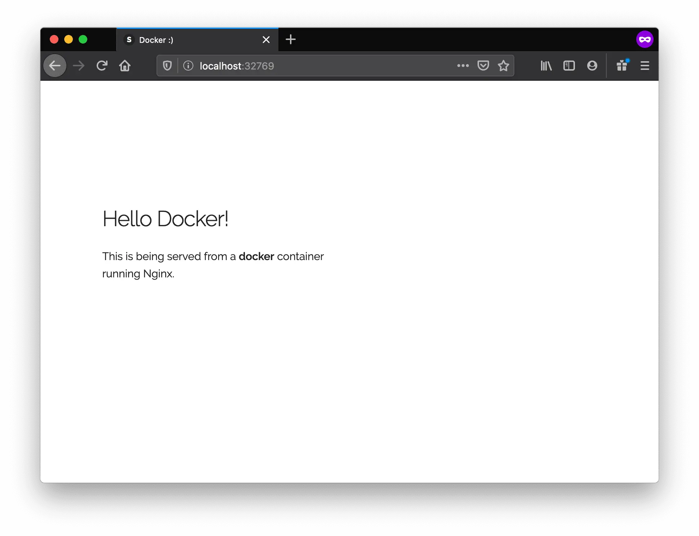

# This article continue official [docker tutorial for beginners](https://docker-curriculum.com/) and my own *docker beginner tutorial*

## Deploying web app

### 1. lets clone docker image from docker hub and run it
```
$ docker pull prakhar1989/static-site
```
this is a single-page website for this article.

also we can download and run this image with `docker run <name>`:
```
$ docker run --rm prakhar1989/static-site
```

output:
```
Nginx is running...
```

for stop container hit `<Ctrl-C>`

### 2. **detached mode**

Well, in this case, the client is not exposing any ports so we need to re-run the docker run command to publish ports. While we're at it, we should also find a way so that our terminal is not attached to the running container. **This way, you can happily close your terminal and keep the container running**. This is called **detached mode**.

```
$ docker run -d -P --name static-site prakhar1989/static-site
```

flags meaning:
* `-d` - detach our terminal
* `-P` - publish all exposed port to random ports
* `--name` - corresponds to a name we want to give


### 3. Ports

Now lets see the ports by running this command:

1. `docker port <container name>` - print container's ports
2. `docker port <container ID` - stop container (also u can use name of container)
   
In our case:
```
$ docker port static-site
```
output:
```
443/tcp -> 0.0.0.0:49153
443/tcp -> :::49153
80/tcp -> 0.0.0.0:49154
80/tcp -> :::49154
```
now you can open it in browser:
```
http://localhost:49154
```

and get this:


**also you can create custom ports with flag `-p`**

i.e.
```
$ docker run -p 8888:80 prakhar1989/static-site
```

now stop container:
```
$ docker stop static-site
```

### 4. Instruction

To deploy this on a real server you would just need to install Docker, and run the above Docker command. Now that you've seen how to run a webserver inside a Docker image, you must be wondering - how do I create my own Docker image? This is the question we'll be exploring in the next section.