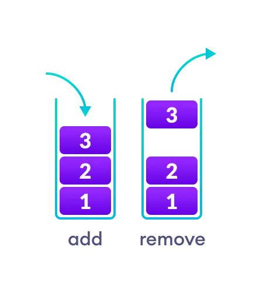
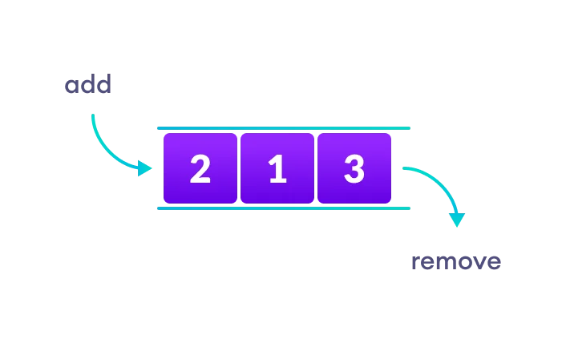
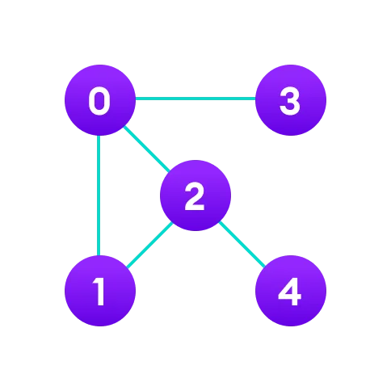
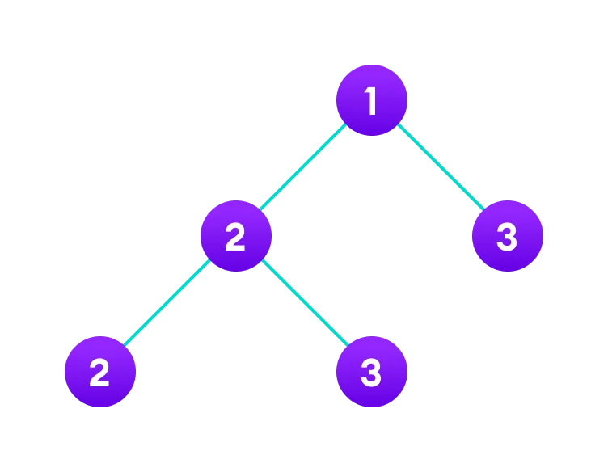

# Introduction
This article cover:
1.  [What is an Algorithm?](https://www.programiz.com/dsa/algorithm)
2.  [Data Structure and Types](https://www.programiz.com/dsa/data-structure-types)

## Basics terms

### What is as **algorithm**?

> In computer programming terms, an algorithm is a set of well-defined instructions to solve a particular problem. It takes a set of input and produces a desired output

Example (Check whether a number is prime or not ):
```
Step 1: Start
Step 2: Declare variables n, i, flag.
Step 3: Initialize variables
        flag ← 1
        i ← 2  
Step 4: Read n from the user.
Step 5: Repeat the steps until i=(n/2)
     5.1 If remainder of n÷i equals 0
            flag ← 0
            Go to step 6
     5.2 i ← i+1
Step 6: If flag = 0
           Display n is not prime
        else
           Display n is prime
Step 7: Stop 
```

### What are **data structures**?

> Data structure is a storage that is used to store and organize data. It is a way of arranging data on a computer so that it can be accessed and updated efficiently.

**Note**: Data structure and data types are slightly different. Data structure is the collection of data types arranged in a specific order.

#### Types of Data Structure:

* Linear data structure
* Non-linear data structure

### **Linear data structures**

> In linear data structures, the elements are arranged in sequence one after the other. Since elements are arranged in particular order, they are easy to implement.

However, when the complexity of the program increases, the linear data structures might not be the best choice because of operational complexities. 

Some of them:
1. **Array** data structure
   
   > In an array, elements in memory are arranged in continuous memory. All the elements of an array are of the same type. And, the type of elements that can be stored in the form of arrays is determined by the programming language. i.e.: Java array, C++ vector

    *An array with each element represented by an index*
   

2. **Stack** data structure
   
    > In stack data structure, elements are stored in the **LIFO principle**. That is, the **last element stored in a stack will be removed first**.

    **Note:** LIFO - last input, first output

    *In a stack, operations can be perform only from one end (top here).*
    

3. **Queue** data structure

    > Unlike stack, the queue data structure works in the FIFO principle where first element stored in the queue will be removed first.

    **Note:** FIFO - first input, first output

    *In a queue, addition and removal are performed from separate ends.*
    

4. **Linked List** data structure
   
   > In linked list data structure, data elements are connected through a series of nodes. And, each node contains the data items and address to the next node.

   

### **Non-linear data structures**

> Unlike linear data structures, elements in non-linear data structures are not in any sequence. Instead they are arranged in a hierarchical manner where one element will be connected to one or more elements.

Some of them:

1. **Graph** data structure

    > In graph data structure, each node is called vertex and each vertex is connected to other vertices through edges.

    

2. **Trees** data structure

    > Similar to a graph, a tree is also a collection of vertices and edges. However, in tree data structure, there can only be one edge between two vertices.

    


## Linear Vs Non-linear Data Structures

| **Linear Data Structures** | **Non-Linear Data Structures** |
| :--- | :--- |
|The data items are arranged in sequential order, one after the other.| The data items are arranged in non-sequential order (hierarchical manner).|
|All the items are present on the single layer.| The data items are present at different layers.|
|It can be traversed on a single run. That is, if we start from the first element, we can traverse all the elements sequentially in a single pass.|It requires multiple runs. That is, if we start from the first element it might not be possible to traverse all the elements in a single pass.|
|The memory utilization is not efficient.|Different structures utilize memory in different efficient ways depending on the need.|
|The time complexity increase with the data size.|Time complexity remains the same.|
