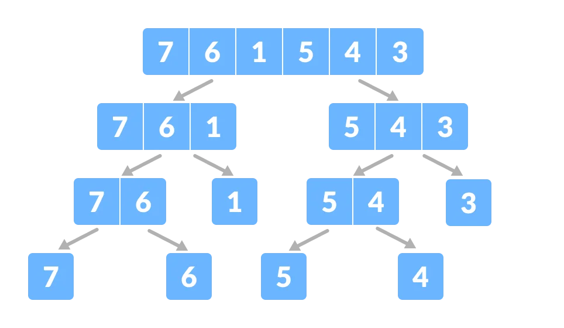
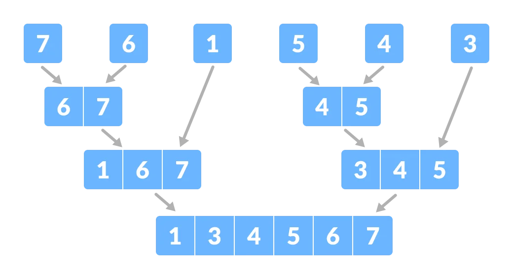

# **Divide** and **Conquer** Algorithm
This article cover:
1. [Divide and Conquer Algorithm](https://www.programiz.com/dsa/divide-and-conquer)

## Preamble

A divide and conquer algorithm is a strategy of solving a large problem by

1. breaking the problem into smaller sub-problems
2. solving the sub-problems, and
3. combining them to get the desired output.

To use the divide and conquer algorithm, **recursion** is used.

## How it work?

Here are the steps involved:

1. **Divide**: Divide the given problem into sub-problems using recursion.
2. **Conquer**: Solve the smaller sub-problems recursively. If the subproblem is small enough, then solve it directly.
3. **Combine**: *Combine* the solutions of the sub-problems that are part of the recursive process to solve the actual problem.

Example: we will sort an array using the divide and *conquer* approach (ie. merge sort)

1. Let the given array be:


2. **Divide** the array into two halves.


Again, divide each subpart recursively into two halves until you get individual elements.



3. Now, combine the individual elements in a sorted manner. Here, **conquer** and **combine** steps go side by side.



## Time Complexity
 
The complexity of the divide and conquer algorithm is calculated using the **master theorem**.

For a merge sort, the equation can be written as:

```
T(n) = aT(n/b) + f(n)
     = 2T(n/2) + O(n)
Where, 
a = 2 (each time, a problem is divided into 2 subproblems)
n/b = n/2 (size of each sub problem is half of the input)
f(n) = time taken to divide the problem and merging the subproblems
T(n/2) = O(n log n) (To understand this, please refer to the master theorem.)

Now, T(n) = 2T(n log n) + O(n)
          ≈ O(n log n)
```

## Divide and Conquer Vs Dynamic approach

The divide and conquer approach divides a problem into smaller subproblems; these subproblems are further solved recursively. The result of each subproblem is not stored for future reference, whereas, in a dynamic approach, the result of each subproblem is stored for future reference.

> *Use the divide and conquer approach* **when** the same subproblem **is not solved multiple times**.

> *Use the dynamic approach* **when** the result of a subproblem is to be **used multiple times in the future**.

Let us understand this with an example. Suppose we are trying to find the Fibonacci series. Then,

**Divide and Conquer approach:**

```
fib(n)
    If n < 2, return 1
    Else , return f(n - 1) + f(n -2)
```

**Dynamic approach:**

In a dynamic approach, mem stores the result of each subproblem.

```
mem = []
fib(n)
    If n in mem: return mem[n] 
    else,     
        If n < 2, f = 1
        else , f = f(n - 1) + f(n -2)
        mem[n] = f
        return f
```

## Advantages of Divide and Conquer Algorithm

* This approach is suitable for multiprocessing systems.
* It makes efficient use of memory caches.
* The complexity for the multiplication of two matrices using the naive method is O(n3), whereas using the divide and conquer approach (i.e. Strassen's matrix multiplication) is O(n2.8074). This approach also simplifies other problems, such as the Tower of Hanoi.
