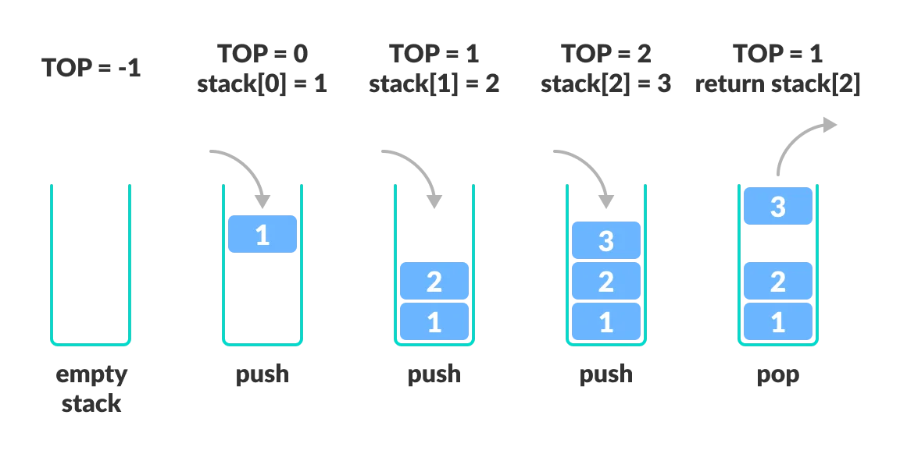
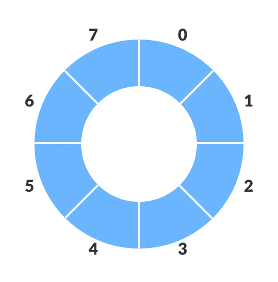
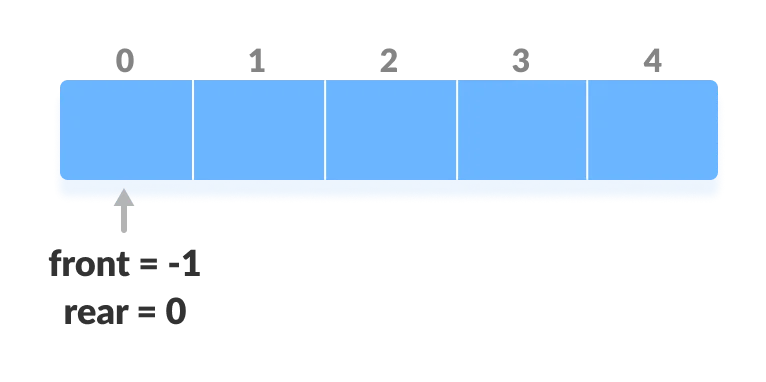
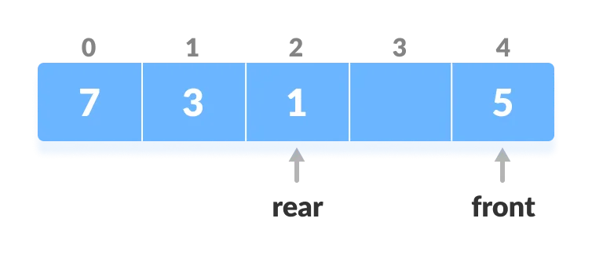
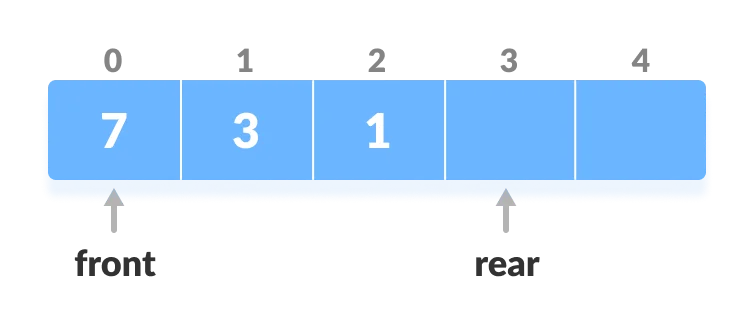
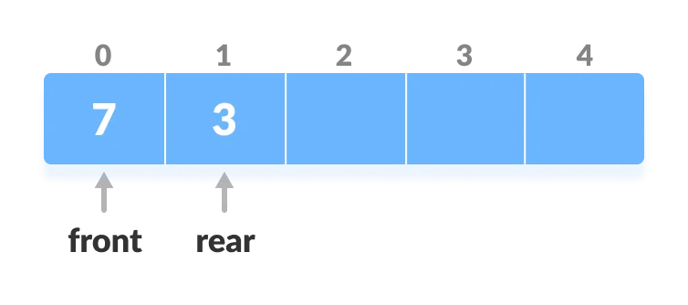

# Stack and Queue and types of queue

This article cover:
1. [Stack Data Structure](https://www.programiz.com/dsa/stack)
2. [Queue Data Structure](https://www.programiz.com/dsa/queue)
3. [Types of Queues](https://www.programiz.com/dsa/types-of-queue)
4. [Circular Queue Data Structure](https://www.programiz.com/dsa/circular-queue)
5. [Priority Queue](https://www.programiz.com/dsa/priority-queue)
6. [Deque Data Structure](https://www.programiz.com/dsa/deque) 

## Stack data structure

> A stack is a linear data structure that follows the principle of **Last In First Out (LIFO)**. This means the last element inserted inside the stack is removed first.

You can think of the stack data structure as the pile of plates on top of another.

Here, you can:
* Put a new plate on top
* Remove the top plate
  
And, if you want the plate at the bottom, you must first remove all the plates on top. This is exactly how the stack data structure works.

### LIFO Principle of Stack

In programming terms, putting an item on top of the stack is called **push** and removing an item is called **pop**.


### Basic Operations of Stack

There are some basic operations that allow us to perform different actions on a stack.

* **Push**: Add an element to the top of a stack
* **Pop**: Remove an element from the top of a stack
* **IsEmpty**: Check if the stack is empty
* **IsFull**: Check if the stack is full
* **Peek**: Get the value of the top element without removing it

### Working of Stack Data Structure

The operations work as follows:

1. A pointer called TOP is used to keep track of the top element in the stack.
2. When initializing the stack, we set its value to -1 so that we can check if the stack is empty by comparing TOP == -1.
3. On pushing an element, we increase the value of TOP and place the new element in the position pointed to by TOP.
4. On popping an element, we return the element pointed to by TOP and reduce its value.
5. Before pushing, we check if the stack is already full
6. Before popping, we check if the stack is already empty



### Stack Time Complexity

For the array-based implementation of a stack, **the push and pop operations** take constant time, i.e. `O(1)`.


### Applications of Stack Data Structure

Although stack is a simple data structure to implement, it is very powerful. The most common uses of a stack are:

* **To reverse a word** - Put all the letters in a stack and pop them out. Because of the LIFO order of stack, you will get the letters in reverse order.
* **In compilers** - Compilers use the stack to calculate the value of expressions like 2 + 4 / 5 * (7 - 9) by converting the expression to prefix or postfix form.
* **In browsers** - The back button in a browser saves all the URLs you have visited previously in a stack. Each time you visit a new page, it is added on top of the stack. When you press the back button, the current URL is removed from the stack, and the previous URL is accessed.

## Queue data structure

A queue is a useful data structure in programming. It is similar to the ticket queue outside a cinema hall, where the first person entering the queue is the first person who gets the ticket.

Queue follows the **First In First Out (FIFO) rule** - the item that goes in first is the item that comes out first.


In the above image, since 1 was kept in the queue before 2, it is the first to be removed from the queue as well. It follows the **FIFO** rule.

In programming terms, putting items in the queue is called **enqueue**, and removing items from the queue is called **dequeue**.

### Basic Operations of Queue

A queue is an object (an abstract data structure - ADT) that allows the following operations:

* **Enqueue**: Add an element to the end of the queue
* **Dequeue**: Remove an element from the front of the queue
* **IsEmpty**: Check if the queue is empty
* **IsFull**: Check if the queue is full
* **Peek**: Get the value of the front of the queue without removing it

### Working of Queue

Queue operations work as follows:

* two pointers `FRONT` and `REAR`
* `FRONT` track the first element of the queue
* `REAR` track the last element of the queue
* initially, set value of `FRONT` and `REAR` to -1

#### Enqueue Operation
* check if the queue is full
* for the first element, set the value of `FRONT` to 0
* increase the `REAR` index by 1
* add the new element in the position pointed to by REAR

#### Dequeue Operation
* check if the queue is empty
* return the value pointed by `FRONT`
* increase the `FRONT` index by 1
* for the last element, reset the values of `FRONT` and REAR to -1


### Limitations of Queue

As you can see in the image below, after a bit of enqueuing and dequeuing, the size of the queue has been reduced.


And we can only add indexes 0 and 1 only when the queue is reset (when all the elements have been dequeued).

After `REAR` reaches the last index, if we can store extra elements in the empty spaces (0 and 1), we can make use of the empty spaces. **This is implemented by a modified queue called the circular queue**.

### Complexity Analysis

The complexity of **enqueue** and **dequeue** operations in a queue using an array is `O(1)`. If you use **pop(N) in python code**, then the complexity might be `O(n)` depending on the position of the item to be popped.

### Applications of Queue

* CPU scheduling, Disk Scheduling
* When data is transferred asynchronously between two processes.The queue is used for synchronization. For example: IO Buffers, pipes, file IO, etc
* Handling of interrupts in real-time systems.
* Call Center phone systems use Queues to hold people calling them in order.

## Types of Queues

There are four different types of queues:

* **Simple Queue**

    In a simple queue, insertion takes place at the rear and removal occurs at the front. It strictly follows the FIFO (First in First out) rule.

* **Circular Queue**

    In a circular queue, the last element points to the first element making a circular link.

    

    **The main advantage of a circular queue over a simple queue is better memory utilization**. If the last position is full and the first position is empty, we can insert an element in the first position. This action is not possible in a simple queue.

* **Priority Queue**

    A priority queue is a special type of queue in which each element is associated with a priority and is served according to its priority. If elements with the same priority occur, they are served according to their order in the queue.

    

    Insertion occurs based on the arrival of the values and removal occurs based on priority.

* **Double Ended Queue**

    In a double ended queue, insertion and removal of elements can be performed from either from the front or rear. Thus, **it does not follow the FIFO** (First In First Out) rule.

    

## Circular Queue data structure

A circular queue is the extended version of a regular queue where the last element is connected to the first element. Thus forming a circle-like structure.



The circular queue solves the major limitation of the normal queue. In a normal queue, after a bit of insertion and deletion, there will be non-usable empty space.

*Limitation of the regular Queue*


Here, indexes 0 and 1 can only be used after resetting the queue (deletion of all elements). This reduces the actual size of the queue.

### How Circular Queue works

Circular Queue works by the process of circular increment i.e. when we try to increment the pointer and we reach the end of the queue, we start from the beginning of the queue.

Here, the circular increment is performed by modulo division with the queue size. That is,

```
(5 - size of queue)
if REAR + 1 == 5 (overflow!),
    REAR = (REAR + 1)%5 = 0 (start of queue)
```

### Circular Queue Operations

The circular queue work as follows:

* two pointers `FRONT` and `REAR`
* `FRONT` track the first element of the queue
* `REAR` track the last elements of the queue
* initially, set value of `FRONT` and `REAR` to -1

**1. Enqueue Operation**
   
* check if the queue is full
* for the first element, set value of `FRONT` to 0
* circularly increase the `REAR` index by 1 (i.e. if the rear reaches the end, next it would be at the start of the queue)
* add the new element in the position pointed to by `REAR`

**2. Dequeue Operation**
   
* check if the queue is empty
* return the value pointed by `FRONT`
* circularly increase the `FRONT` index by 1
* for the last element, reset the values of `FRONT` and `REAR` to -1

However, the check for full queue has a new additional case:

* Case 1: `FRONT` = 0 && `REAR == SIZE - 1`
* Case 2: `FRONT = REAR + 1`

The second case happens when `REAR` starts from 0 due to circular increment and when its value is just 1 less than `FRONT`, the queue is full.


### Circular Queue Complexity Analysis
The complexity of the **enqueue and dequeue operations** of a circular queue is `O(1)` *for array implementations*.

### Applications of Circular Queue
* CPU scheduling
* Memory management
* Traffic Management

## Priority Queue

A priority queue is a **special type of queue** in which each element is associated with a **priority value**. And, elements are served on the basis of their priority. That is, higher priority elements are served first.

However, if elements with the same priority occur, they are served according to their order in the queue.

### Assigning Priority Value

Generally, the value of the element itself is considered for assigning the priority. For example,

The element with the highest value is considered the highest priority element. However, in other cases, we can assume the element with the lowest value as the highest priority element.

We can also set priorities according to our needs.


### Difference between Priority Queue and Normal Queue

In a queue, the **first-in-first-out rule** is implemented whereas, in a priority queue, the values are removed **on the basis of priority**. The element with the highest priority is removed first.

### Implementation of Priority Queue

Priority queue can be implemented using an array, a linked list, a heap data structure, or a binary search tree. Among these data structures, heap data structure provides an efficient implementation of priority queues.

A comparative analysis of different implementations of priority queue is given below.

| Operations | peek | insert | delete |
| :--- | :---: | :---: | :---: |
| Linked List | O(1) | O(n) | O(1) |
| Binary Heap | O(1) | O(log n) | O(log n) |
| Binary Search Tree | O(1) | O(log n) | O(log n) |

### Priority Queue Applications
Some of the applications of a priority queue are:

* Dijkstra's algorithm
* for implementing stack
* for load balancing and interrupt handling in an operating system
* for data compression in Huffman code

## Deque data structure

Deque or Double Ended Queue is a type of queue in which insertion and removal of elements can either be performed from the front or the rear. Thus, it does not follow FIFO rule (First In First Out).


### Types of Deque

* **Input Restricted Deque** - In this deque, input is restricted at a single end but allows deletion at both the ends.

* **Output Restricted Deque** - In this deque, output is restricted at a single end but allows insertion at both the ends.
  
### Operations on a Deque

Below is the circular array implementation of deque. In a circular array, if the array is full, we start from the beginning.

But in a linear array implementation, if the array is full, no more elements can be inserted. In each of the operations below, if the array is full, "overflow message" is thrown.

Before performing the following operations, these steps are followed.

1. Take an array (deque) of size `n`.
2. Set two pointers at the first position and set `front = -1` and `rear = 0`.



#### 1. Insert at the Front

This operation adds an element at the front.

1. Check the position of front.

    

2. If `front < 1`, reinitialize `front = n-1` (last index).

    

3. Else, decrease `front` by 1.
4. Add the new key `5` into `array[front]`.

    

#### **2. Insert at the Rear**

This operation adds an element to the rear.

1. Check if the array is full.

    

2. If the deque is full, reinitialize `rear = 0`.
3. Else, increase `rear` by 1.

    

4. Add the new key 5 into array[rear].

    

#### **3. Delete from the Front**

The operation deletes an element from the front.

1. Check if the deque is empty.

    

2. If the deque is empty (i.e. `front = -1`), deletion cannot be performed (**underflow condition**).
3. If the deque has only one element (i.e. `front = rear`), set `front = -1` and `rear = -1`.
4. Else if front is at the end (i.e. `front = n - 1`), set go to the front `front = 0`.
5. Else, `front = front + 1`.

    

#### **4. Delete from the Rear**

This operation deletes an element from the rear.

1. Check if the deque is empty.

    

2. If the deque is empty (i.e. `front = -1`), deletion cannot be performed (**underflow condition**).
3. If the deque has only one element (i.e. `front = rear`), set `front = -1` and `rear = -1`, else follow the steps below.
4. If `rear` is at the front (i.e. `rear = 0`), set go to the front `rear = n - 1`.
5. Else, `rear = rear - 1`.

    

#### **5. Check Empty**

This operation checks if the deque is empty. If `front = -1`, the deque is empty.

#### **6. Check Full**

This operation checks if the deque is full. If `front = 0` **and** `rear = n - 1` **OR** `front = rear + 1`, the deque is full.

### Time Complexity

The time complexity of all the above operations is constant i.e. `O(1)`.

### Applications of Deque Data Structure
* In undo operations on software.
* To store history in browsers.
* For implementing both stacks and queues.