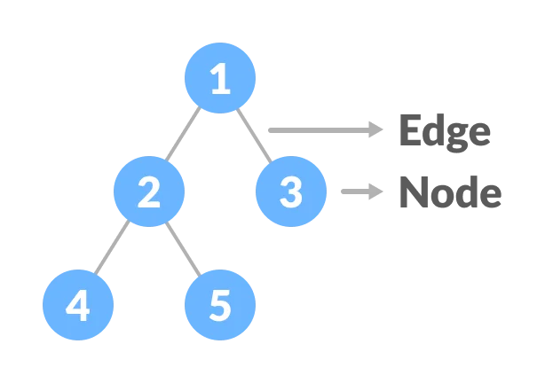
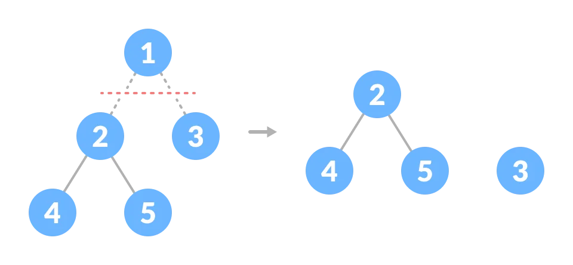
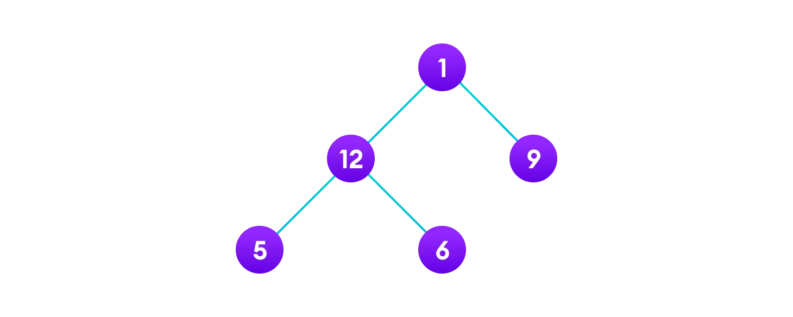
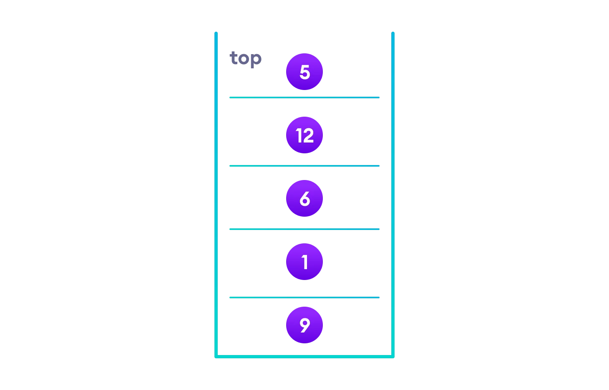

# Tree DS

This article cover:
1. [Tree Data Structure](https://www.programiz.com/dsa/linked-list)
2. [Tree Traversal - inorder, preorder and postorder](https://www.programiz.com/dsa/tree-traversal)

## Intro

A tree is a nonlinear hierarchical data structure that consists of nodes connected by edges.


### Why tree ds?

Other data structures such as arrays, linked list, stack, and queue are linear data structures that store data sequentially. In order to perform any operation in a linear data structure, the time complexity increases with the increase in the data size. But, it is not acceptable in today's computational world.

Different tree data structures allow quicker and easier access to the data as it is a non-linear data structure.

## Tree Terminologies

1. **Node**
    A node is an entity that contains a key or value and pointers to its child nodes.

    The last nodes of each path are called **leaf nodes or external nodes** that do not contain a link/pointer to child nodes.

    The node having at least a child node is called an **internal node**.

2. **Edge**
   
    It is the link between any two nodes.

    

3. **Root**
   
    It is the topmost node of a tree.

4. **Height of a Node**

    The height of a node is the number of edges from the node to the deepest leaf (ie. the longest path from the node to a leaf node).

5. **Depth of a Node**
    
    The depth of a node is the number of edges from the root to the node.

6. **Height of a Tree**
    
    The height of a Tree is the height of the root node or the depth of the deepest node.

    

7. **Degree of a Node**

    The degree of a node is the total number of branches of that node.

8. **Forest**

    A collection of disjoint trees is called a forest.

    

    You can create a forest by cutting the root of a tree.

## Tree Applications

* Binary Search Trees(BSTs) are used to quickly check whether an element is present in a set or not.
* Heap is a kind of tree that is used for heap sort.
* A modified version of a tree called Tries is used in modern routers to store routing information.
* Most popular databases use B-Trees and T-Trees, which are variants of the tree structure
* Compilers use a syntax tree to validate the syntax of every program you write.

## Tree Traversal - inorder, preorder and postorder

Traversing a tree means visiting every node in the tree. You might, for instance, want to add all the values in the tree or find the largest one. For all these operations, you will need to visit each node of the tree.

Linear data structures like arrays, stacks, queues, and linked list have only one way to read the data. But a hierarchical data structure like a tree can be traversed in different ways.



Let's think about how we can read the elements of the tree in the image shown above.

Starting from top, Left to right:

```cpp
1 -> 12 -> 5 -> 6 -> 9
```

Starting from bottom, Left to right

```cpp
5 -> 6 -> 12 -> 9 -> 1
```

Although this process is somewhat easy, it doesn't respect the hierarchy of the tree, only the depth of the nodes.

Instead, we use traversal methods that take into account the basic structure of a tree i.e.

```cpp
struct node {
    int data;
    struct node* left;
    struct node* right;
}
```

The struct node pointed to by left and right might have other left and right children so **we should think of them as sub-trees instead of sub-nodes**.

According to this structure, every tree is a combination of

* A node carrying data
* Two subtrees


Remember that our goal is to visit each node, so we need to visit all the nodes in the subtree, visit the root node and visit all the nodes in the right subtree as well.

Depending on the order in which we do this, there can be **three types of traversal**.

### **1. Inorder traversal**

* First, visit all the nodes in the left subtree
* Then the root node
* Visit all the nodes in the right subtree

```cpp
inorder(root->left)
display(root->data)
inorder(root->right)
```

### **2. Preorder traversal**

* Visit root node
* Visit all the nodes in the left subtree
* Visit all the nodes in the right subtree

```cpp
display(root->data)
preorder(root->left)
preorder(root->right)
```

### **3. Postorder traversal**

* Visit all the nodes in the left subtree
* Visit all the nodes in the right subtree
* Visit the root node

```cpp
postorder(root->left)
postorder(root->right)
display(root->data)
```

## Example

Let's visualize in-order traversal. We start from the root node.


We traverse the left subtree first. We also need to remember to visit the root node and the right subtree when this tree is done.

Let's put all this in a stack so that we remember.


Now we traverse to the subtree pointed on the TOP of the stack.

Again, we follow the same rule of inorder

```
Left subtree -> root -> right subtree
```



Since the node "5" doesn't have any subtrees, we print it directly. After that we print its parent "12" and then the right child "6".

Putting everything on a stack was helpful because now that the left-subtree of the root node has been traversed, we can print it and go to the right subtree.

After going through all the elements, we get the inorder traversal as

```cpp
5 -> 12 -> 6 -> 1 -> 9
```

We don't have to create the stack ourselves because recursion maintains the correct order for us.


