# Binary Search Tree (BST)

This article cover:
1. [AVL Tree](https://www.programiz.com/dsa/avl-tree)
2. [AVL Tree | Set 1 (Insertion)](https://www.geeksforgeeks.org/avl-tree-set-1-insertion/?ref=lbp)
3. [AVL Tree | Set 2 (Deletion)](https://www.geeksforgeeks.org/avl-tree-set-2-deletion/?ref=lbp)

## Intro

AVL tree is a self-balancing binary search tree in which each node maintains extra information called a balance factor whose value is either -1, 0 or +1.

AVL tree got its name after its inventor Georgy Adelson-Velsky and Landis.

> **Why AVL Trees?**
   
>  Most of the BST operations (e.g., search, max, min, insert, delete.. etc) take O(h) time where h is the height of the BST. The cost of these operations may become O(n) for a skewed Binary tree. If we make sure that height of the tree remains O(Logn) after every insertion and deletion, then we can guarantee an upper bound of O(Logn) for all these operations. The height of an AVL tree is always O(Logn) where n is the number of nodes in the tree. 
> 
## Balance factor

Balance factor of a node in an AVL tree is the difference between the height of the left subtree and that of the right subtree of that node.

Balance Factor = (Height of Left Subtree - Height of Right Subtree) or (Height of Right Subtree - Height of Left Subtree)

The self balancing property of an avl tree is maintained by the balance factor. The value of balance factor should always be -1, 0 or +1.

An example of a balanced avl tree is:

## Operations on an AVL tree

Various operations that can be performed on an AVL tree are:

### Rotating the subtrees in an AVL Tree

In rotation operation, the positions of the nodes of a subtree are interchanged.

There are two types of rotations:

#### **Left Rotate**

In left-rotation, the arrangement of the nodes on the right is transformed into the arrangements on the left node.

Algorithm

1. Let the initial tree be:
   
    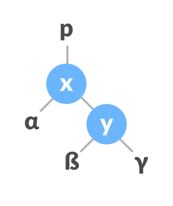

2. If `y` has a left subtree, assign `x` as the parent of the left subtree of `y`

    

3. If the parent of `x` is `NULL`, make `y` as the root of the tree.
4. Else if `x` is the left child of `p`, make `y` as the left child of `p`.
5. Else assign `y` as the right child of `p`.

    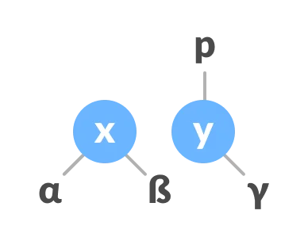

6. Make `y` as the parent of `x`.

    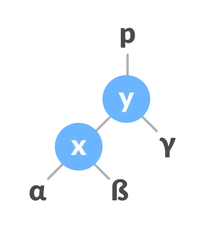

#### **Right Rotate**

In left-rotation, the arrangement of the nodes on the left is transformed into the arrangements on the right node.

1. Let the initial tree be:
   
    

2. If `x` has a right subtree, assign `y` as the parent of the right subtree of `x`.

    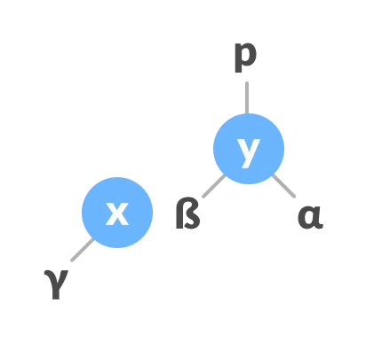

3. If the parent of `y` is `NULL`, make `x` as the root of the tree.
4. Else if `y` is the right child of its parent `p`, make `x` as the right child of `p`.
5. Else assign `x` as the left child of `p`.

    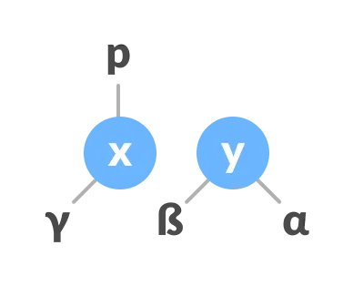

6. Make `x` as the parent of `y`.

    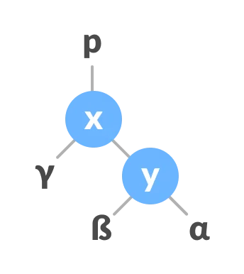

#### **Left-Right and Right-Left Rotate**

In left-right rotation, the arrangements are first shifted to the left and then to the right.

1. Do left rotation on x-y.

    

2. Do right rotation on y-z.
3. 
    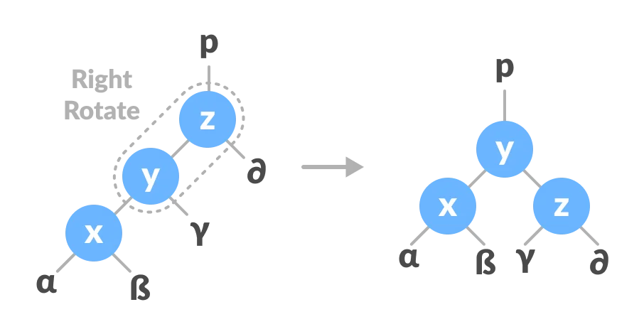

In right-left rotation, the arrangements are first shifted to the right and then to the left.

1. Do right rotation on x-y.

    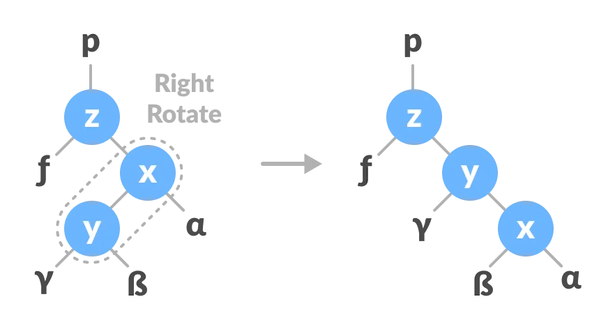

2. Do left rotation on z-y.

    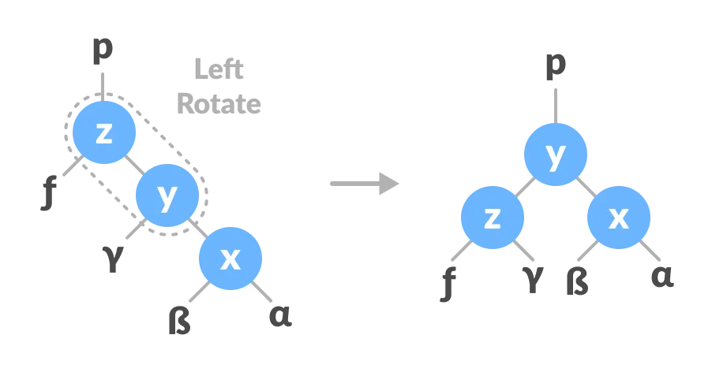

### **Algorithm to insert a newNode**

A `newNode` is always inserted as a leaf node with balance factor equal to 0.

1. Let the initial tree be:

    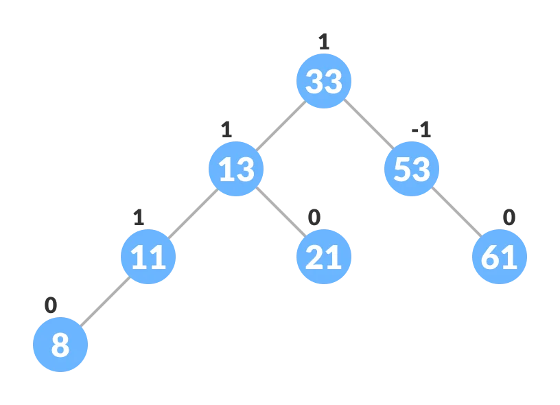

    Let the node to be inserted be:

    

2. Go to the appropriate leaf node to insert a `newNode` using the following recursive steps. Compare `newKey` with `rootKey` of the current tree.

    * If `newKey` < `rootKey`, call insertion algorithm on the left subtree of the current node until the leaf node is reached.

    * Else if `newKey` > `rootKey`, call insertion algorithm on the right subtree of current node until the leaf node is reached.

    * Else, return `leafNode`.

    

3. Compare `leafKey` obtained from the above steps with `newKey`:

    * If `newKey` < `leafKey`, make `newNode` as the `leftChild` of `leafNode`.
    * Else, make `newNode` as `rightChild` of `leafNode`

    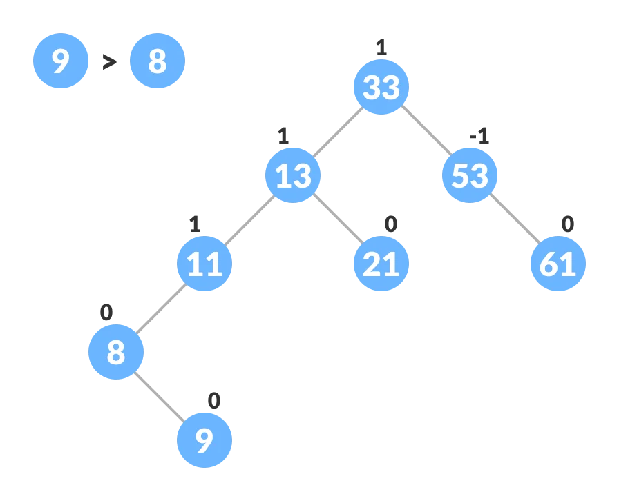

4. Update `balanceFactor` of the nodes.

    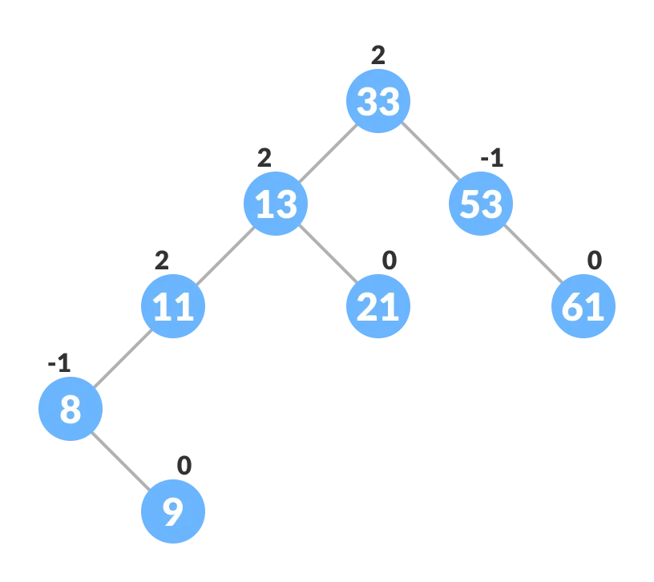
    
5. If the nodes are unbalanced, then rebalance the node.

    * If `balanceFactor` > 1, it means the height of the left subtree is greater than that of the right subtree. So, do a right rotation or left-right rotation
      * If `newNodeKey` < `leftChildKey` do right rotation.
      * Else, do left-right rotation
    * If `balanceFactor` < -1, it means the height of the right subtree is greater than that of the left subtree. So, do right rotation or right-left rotation
      * If `newNodeKey` > `rightChildKey` do left rotation.
      * Else, do right-left rotation

    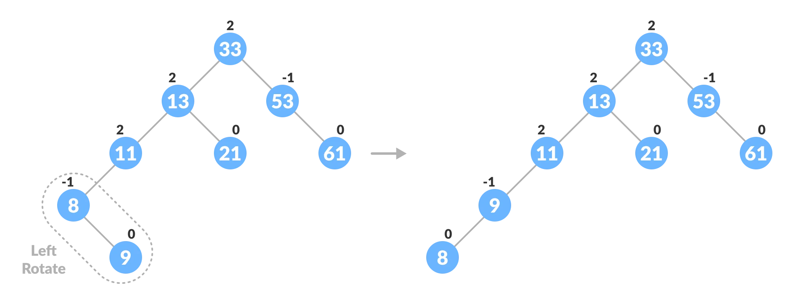

    

6. The final tree is:

    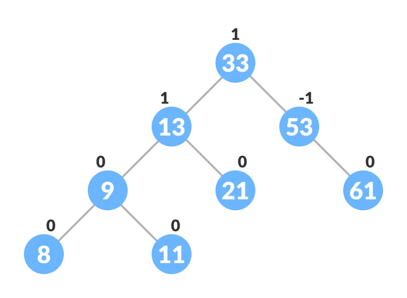

### **Algorithm to Delete a node**

A node is always deleted as a leaf node. After deleting a node, the balance factors of the nodes get changed. In order to rebalance the balance factor, suitable rotations are performed.

1. Locate `nodeToBeDeleted` (recursion is used to find nodeToBeDeleted in the code used below).

    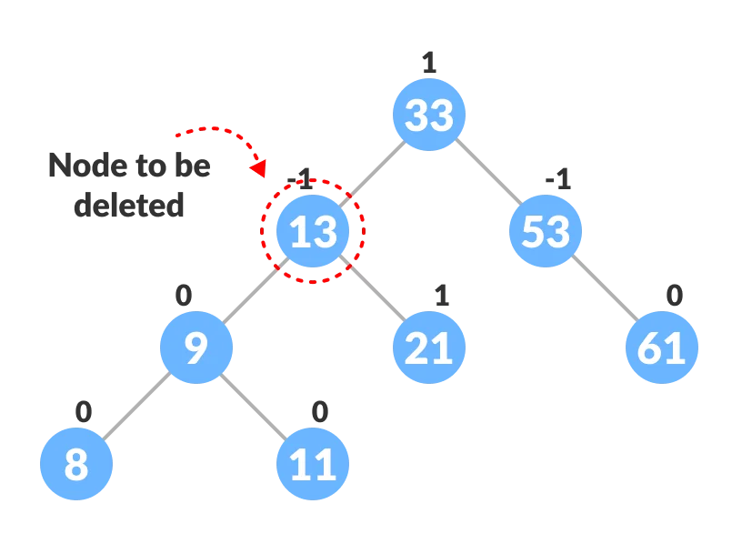

2. There are three cases for deleting a node:

    * If `nodeToBeDeleted` is the leaf node (ie. does not have any child), then remove `nodeToBeDeleted`.
    * If `nodeToBeDeleted` has one child, then substitute the contents of `nodeToBeDeleted` with that of the child. Remove the child.
    * If `nodeToBeDeleted` has two children, find the inorder successor `w` of `nodeToBeDeleted` (ie. node with a minimum value of key in the right subtree).

    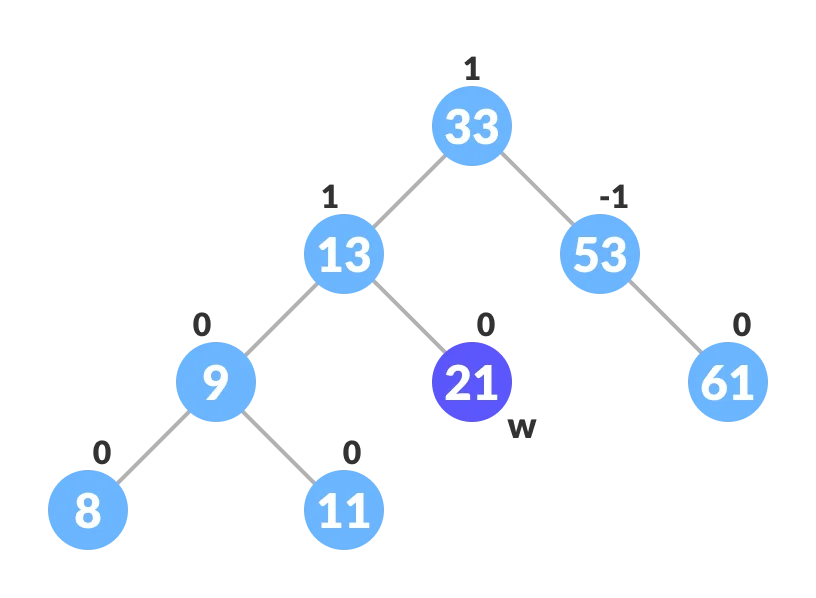

    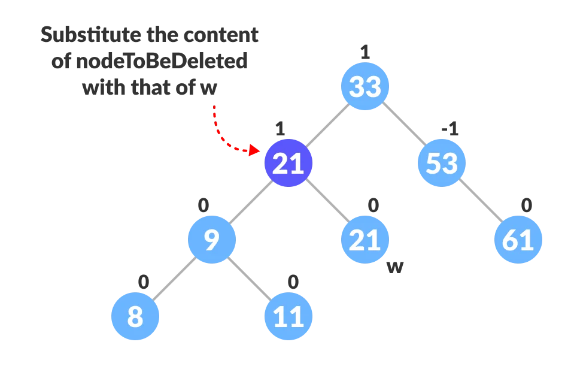

    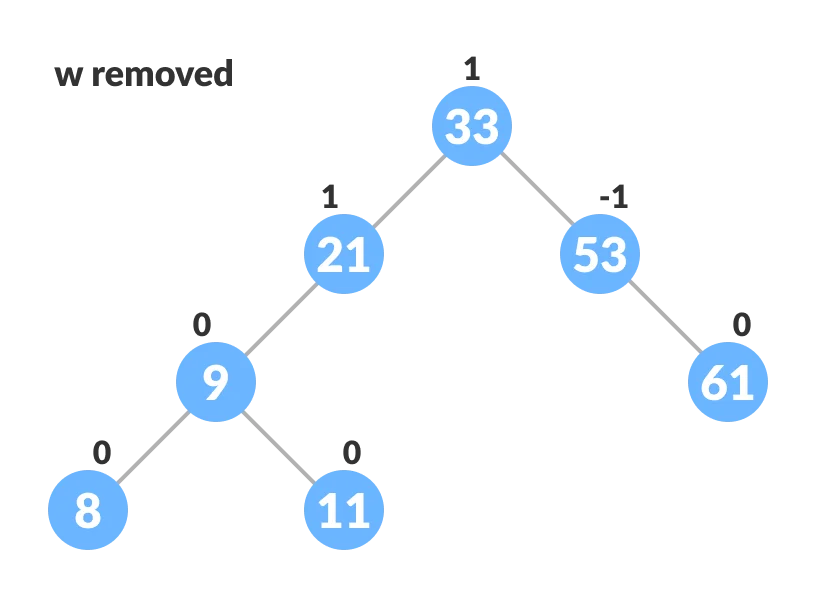

3. Update `balanceFactor` of the nodes.

    

4. Rebalance the tree if the balance factor of any of the nodes is not equal to -1, 0 or 1.
   
    * If `balanceFactor` of `currentNode` > 1,
      * If `balanceFactor` of `leftChild` >= 0, do right rotation.
      * Else do left-right rotation.
    * If `balanceFactor` of `currentNode` < -1,
      * If `balanceFactor` of `rightChild` <= 0, do left rotation.
      * Else do right-left rotation.

    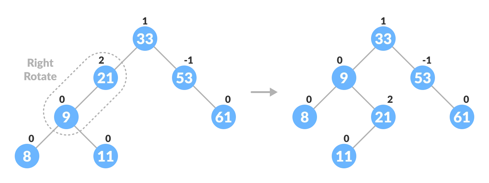

5. The final tree is:

