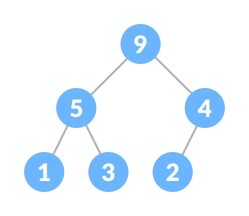
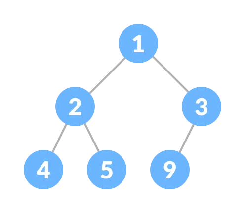
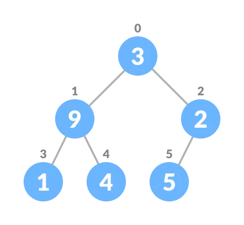
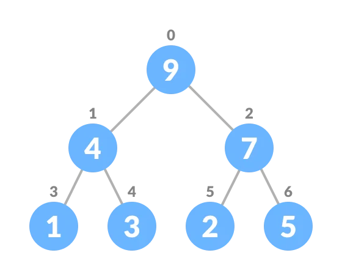
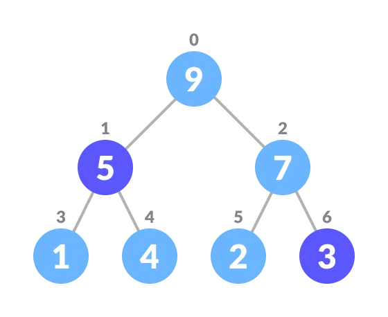

# Binary Heap (also Heap)

This article cover:
1. [Heap data structure](https://www.programiz.com/dsa/heap-data-structure)

## Intro

Heap data structure is a complete binary tree that satisfies **the heap property**, where any given node is

* always greater than its child node/s and the key of the root node is the largest among all other nodes. This property is also called **max heap property**.

* always smaller than the child node/s and the key of the root node is the smallest among all other nodes. This property is also called **min heap property**.


|||
|----|-----|
|It's **Max-heap** | it's **Min-heap** |

## Heap operations

### **Heapify**

Heapify is the process of creating a heap data structure from a binary tree. It is used to create a Min-Heap or a Max-Heap.

1. Let the input array be
 
    

2. Create a complete binary tree from the array
   
    

3. Start from the first index of non-leaf node whose index is given by `n/2 - 1`.

    

4. Set current element `i` as `largest`.
   
5. The index of left child is given by `2i + 1` and the right child is given by `2i + 2`.

    If `leftChild` is greater than `currentElement` (i.e. element at `i` index), set `leftChildIndex` as largest.

    If `rightChild` is greater than element in `largest`, set `rightChildIndex` as `largest`.

6. Swap `largest` with `currentElement`

    

7. Repeat steps 3-7 until the subtrees are also heapified.

#### Algorithm

```python
Heapify(array, size, i)
    set i as largest
    leftChild = 2i + 1
    rightChild = 2i + 2
    
    if leftChild > array[largest]
        set leftChildIndex as largest
    if rightChild > array[largest]
        set rightChildIndex as largest

    swap array[i] and array[largest]
```

To create a Max-Heap:

```python
MaxHeap(array, size)
    loop from the first index of non-leaf node down to zero
        call heapify
```

For Min-Heap, both leftChild and rightChild must be larger than the parent for all nodes.

### **Insert Element into Heap**

Algorithm for insertion in Max Heap

```python
If there is no node, 
  create a newNode.
else (a node is already present)
  insert the newNode at the end (last node from left to right.)
  
heapify the array
```
1. Insert the new element at the end of the tree.

    

2. Heapify the tree.
   
    

For Min Heap, the above algorithm is modified so that `parentNode` is always smaller than `newNode`.

### **Delete Element from Heap**

Algorithm for deletion in Max Heap

```python
If nodeToBeDeleted is the leafNode
  remove the node
Else swap nodeToBeDeleted with the lastLeafNode
  remove noteToBeDeleted
   
heapify the array
```

1. Select the element to be deleted.

    

2. Swap it with the last element.

    

3. Remove the last element.

    

4. Heapify the tree.

    

For Min Heap, above algorithm is modified so that both `childNodes` are greater smaller than `currentNode`.

### **Peek (Find max/min)**

Peek operation returns the maximum element from Max Heap or minimum element from Min Heap without deleting the node.

For both Max heap and Min Heap

```
return rootNode
```

### **Extract-Max/Min**

Extract-Max returns the node with maximum value after removing it from a Max Heap whereas Extract-Min returns the node with minimum after removing it from Min Heap.

## Heap Data Structure Applications

* Heap is used while implementing a priority queue.
* Dijkstra's Algorithm
* Heap Sort