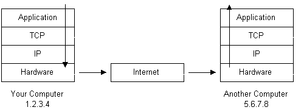

# This article cover [Stanford article about it](https://developer.mozilla.org/en-US/docs/Learn/Common_questions/How_does_the_Internet_work)

## Internet addresses

Because the Internet is a global network of computers each computer connected to the Internet must have a unique address.

Internet addresses are in the form `nnn.nnn.nnn.nnn`.

Each `nnn` segment must be a number from 0 - 255.

This address is known as an **IP address**.

If you connect to the Internet through an Internet Service Provider (ISP), you are usually assigned a temporary IP address for the duration of your dial-in session. If you connect to the Internet from a LAN your computer might have a permanent IP address or it might obtain a temporary one from a DHCP  server. *In any case, if you are connected to the Internet, your computer has a unique IP address.*

Terminology:
> **LAN** - Local Area Network 

> **DHCP** - Dynamic Host Configuration Protocol

## Protocol Stacks and Packets

So your computer is connected to the Internet and has a unique address. How does it 'talk' to other computers connected to the Internet? An example should serve here: Let's say your IP address is 1.2.3.4 and you want to send a message to the computer 5.6.7.8. The message you want to send is "Hello computer 5.6.7.8!". Obviously, the message must be transmitted over whatever kind of wire connects your computer to the Internet. Let's say you've dialed into your ISP from home and the message must be transmitted over the phone line. Therefore the message must be translated from alphabetic text into electronic signals, transmitted over the Internet, then translated back into alphabetic text. How is this accomplished?

> **Answer:** Through the use of a **protocol stack**.
 
Every computer needs one to communicate on the Internet and it is usually built into the computer's operating system (i.e. Windows, Unix, etc.). The protocol stack used on the Internet is refered to as the **TCP/IP protocol** stack because of the two major communication protocols used. 

The TCP/IP stack looks like this:

1. **Application Protocols Layer** - protocols specific to applications such as WWW, e-mail, FTP, etc
2. **Transmission Control Protocol Layer (TCP)** - TCP directs packets to a specific application on a computer using a port number
3. **Internet Protocol Layer (IP)** - IP directs packets to a specific computer using an IP address
4. **Hardware Layer** - Converts binary packet data to network signals and back. (E.g. ethernet network card, modem for phone lines, etc.)

If we were to follow the path that the message "Hello computer 5.6.7.8!" took from our computer to the computer with IP address 5.6.7.8, it would happen something like this:

1. The message would start at the top of the protocol stack on your computer and work it's way downward.
   
2. If the message to be sent is long, each stack layer that the message passes through may break the message up into smaller chunks of data. This is because data sent over the Internet (and most computer networks) are sent in manageable chunks. On the Internet, these chunks of data are known as **packets**.
   
3. The packets would go through the Application Layer and continue to the TCP layer. Each packet is assigned a **port number**. Ports will be explained later, but suffice to say that many programs may be using the TCP/IP stack and sending messages. We need to know which program on the destination computer needs to receive the message because it will be listening on a specific port.
   
4. After going through the TCP layer, the packets proceed to the IP layer. This is where each packet receives it's destination address, 5.6.7.8.
   
5. Now that our message packets have a port number and an IP address, they are ready to be sent over the Internet. The hardware layer takes care of turning our packets containing the alphabetic text of our message into electronic signals and transmitting them over the phone line.
   
6. On the other end of the phone line your ISP has a direct connection to the Internet. The ISPs router examines the destination address in each packet and determines where to send it. Often, the packet's next stop is another router. More on routers and Internet infrastructure later.
   
7. Eventually, the packets reach computer 5.6.7.8. Here, the packets start at the bottom of the destination computer's TCP/IP stack and work upwards.
   
8. As the packets go upwards through the stack, all routing data that the sending computer's stack added (such as IP address and port number) is stripped from the packets.
   
9.  When the data reaches the top of the stack, the packets have been re-assembled into their original form, "Hello computer 5.6.7.8!"

Terminology:
> **ISP** - Internet service provider
> **TCP** - Transmission Control Protocol
> **IP** - Internet protocol
> **packets** - chunks of data transmitted over the Internet (assembled raw data, which is then re-assembled again)

## Networking Infrastructure

So now you know how packets travel from one computer to another over the Internet. But what's in-between? What actually makes up the Internet? Let's look at another diagram:

The physical connection through the phone network to the Internet Service Provider might have been easy to guess, but beyond that might bear some explanation.

The ISP maintains a pool of modems for their dial-in customers. This is managed by some form of computer (usually a dedicated one) which controls data flow from the modem pool to a backbone or dedicated line router. This setup may be refered to as a port server, as it 'serves' access to the network. Billing and usage information is usually collected here as well.

After your packets traverse the phone network and your ISP's local equipment, they are routed onto the ISP's backbone or a backbone the ISP buys bandwidth from. From here the packets will usually journey through several routers and over several backbones, dedicated lines, and other networks until they find their destination, the computer with address 5.6.7.8